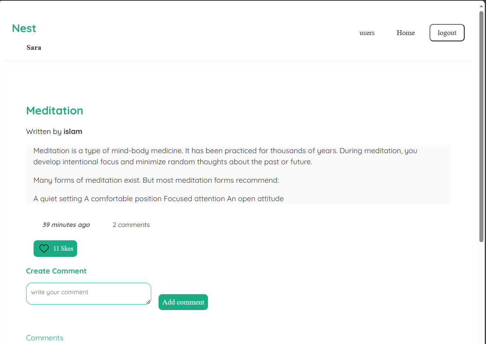
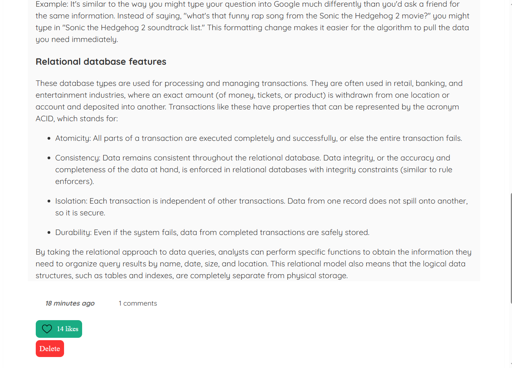
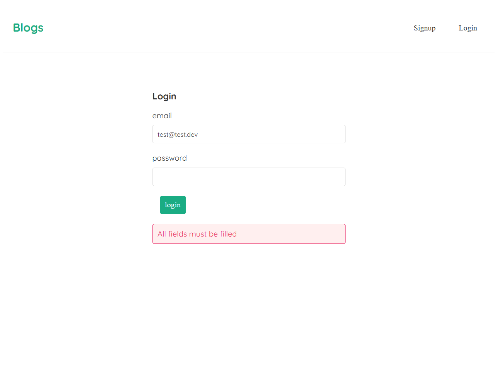

# Blogger

Blogger is a full-stack web application that allows users to create and share blog posts. It is built with React, Node, Express, and Mongoose.

## Features

- User authentication and registration with JWT
- Post creation, editing, and deletion with CRUD operations
- Comment creation, and deletion with CRUD operations
- Markdown support for posts and comments with React Markdown
- Error handling with custom error messages
- React context API for state management and global state access with useContext and useReducer hooks
- React hooks for functional components
- Responsive design to work on all screen sizes

## Usage

- To use Blogger, you need to register an account or log in with an existing one.

- Once logged in, you can create a new blog by clicking on the "New Blog" button in your profile page. You can see the list of all blogs by clicking on the "Home" button on the navbar.

- You can see your profile page by clicking on your name on the navbar.

- You can also comment on any blog by clicking on the "Add Comment" button on the blog detail page.

- You can like a blog by clicking on the "Like" button on the blog detail page or on the "Like" button in the list of all blogs.

- You can see your profile page by clicking on your name on the navbar. You can see the list of all users by clicking on the "Users" button on the navbar.

- You can use Markdown syntax to format your posts and comments. For example, you can use `**bold**` for bold text, `*italic*` for italic text, `# Heading` for headings, etc. You can find more information about Markdown here: https://www.markdownguide.org/basic-syntax/

- You can follow and unfollow other users by clicking on the "Follow" button on their profile page.

## Pages

### Sign up page

- Sign up with email, name, and password
- You should enter a valid email address
- You should enter a strong password
- You should enter all fields

### Home page

- List of all posts with their title, date of creation, and number of comments
- Click on the title of the post to see the post detail page

### Create blog page

- Create a new blog with title and body
- You should enter all fields
- White space is not allowed in any field
- Markdown syntax is supported
- Preview your blog before publishing

### Blog detail page

- Title, author, date of creation, number of comments, and content
- Click on the author to see their profile page
- Click on the "Add Comment" button to add a comment

- Click on the "Delete" button to delete the post if you are the author

### Space page

 
 

### Profile page

- List of all posts with their title, date of creation, and number of comments
- Click on the title of the post to see the post detail page
- List of all comments with their date of creation and content

### List of users page

- List of all users with their email address and name and the date of registration
- Click on the name of the user to see their profile page

### User profile page

- Name, email address, date of registration, and list of all posts with their title, date of creation, and number of comments
- Click on the title of the post to see the post detail page

### Login page

- Log in with email and password
- You should enter a valid email address
- You should enter all fields

### Not found page

- If you enter a wrong URL, you will be redirected to this page

## Contributions

Contributions are welcome! If you find any issues or bugs, please report them on the Github repository's [issue tracker](https://github.com/exampleuser/blogger/issues).

<!-- If you would like to contribute to the project, please fork the repository and submit a pull request. Before submitting a pull request, please make sure your changes follow the project's code style and formatting guidelines. -->
